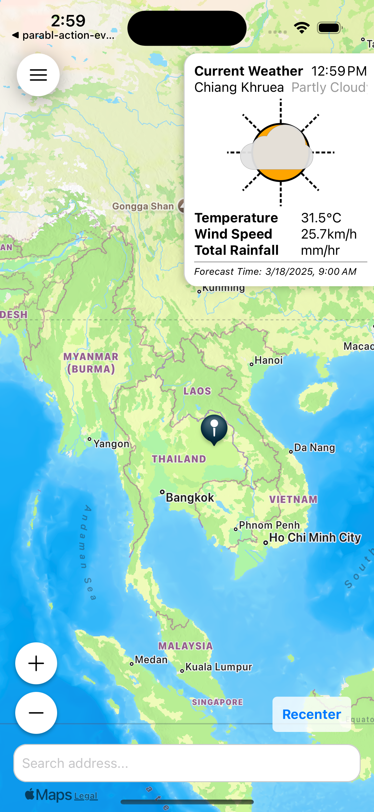
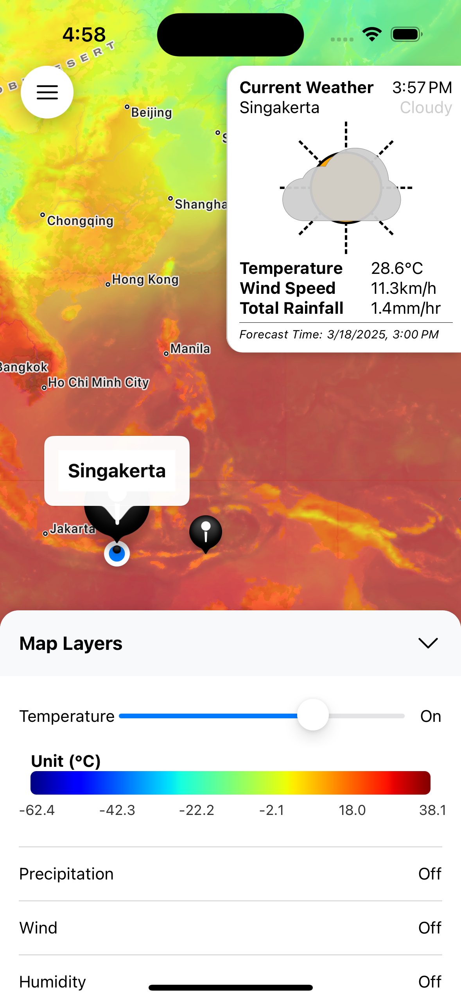
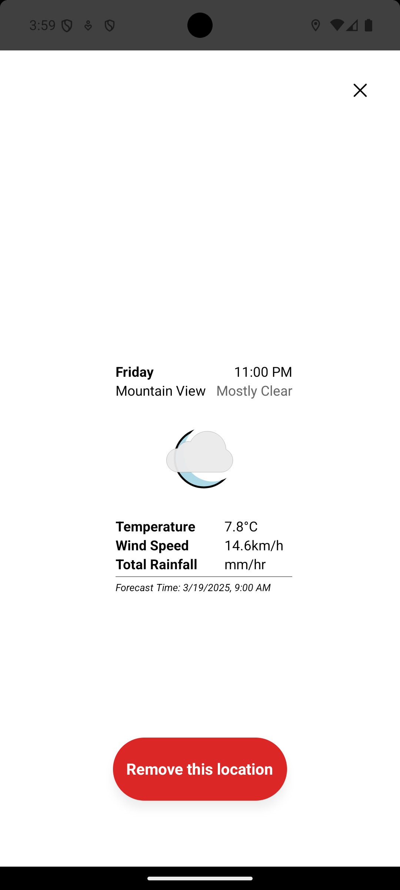
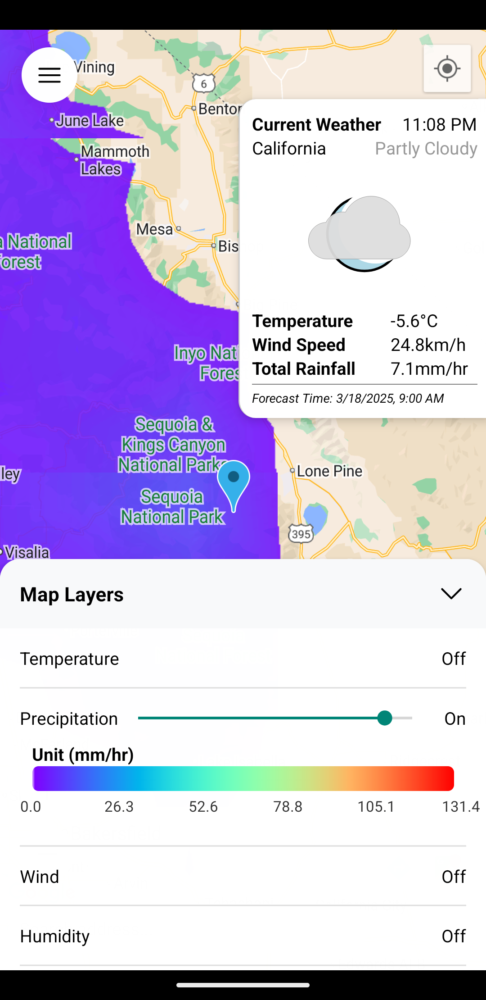

# 🌦️ Parabl Foreshadow – See Tomorrow's Weather Today! 🚀

Welcome to **Parabl Foreshadow**, the playful yet powerful mobile app designed to help you stay ahead of Mother Nature! Built by the innovative folks at **Similie** in Timor-Leste, Parabl Foreshadow brings climate-risk insights straight to your fingertips—wherever you are, wherever you care about.

## 🌏 What’s Parabl Foreshadow All About?

Imagine being able to peek at tomorrow's weather risks, anywhere on the globe. With Parabl Foreshadow, you can do exactly that:

- 📍 **Geo-based Early Warning Alerts:** Save your favorite locations (your home, farm, grandma's house, or that secret fishing spot) and receive early alerts about extreme weather conditions.
- 🌤️ **Detailed 4-Day Forecasts:** Get detailed point forecasts for any location to plan your adventures—or avoid trouble—days ahead.
- 🕒 **Real-Time Weather Checks:** Instantly view the current time and weather conditions anywhere around the globe.
- 🌪️ **Global Weather Layers:** Visualize global weather patterns with interactive map layers showing temperature, precipitation, wind gusts, humidity, and cloud cover. Because who doesn't love pretty maps?

## 📸 Screenshots

<table>
  <tr>
    <td></td>
    <td></td>
    <td></td>
    <td></td>
    
 </tr>
</table>
## 🔧 Getting Started

To run Parabl Foreshadow locally, you'll need a few things set up first:

### 🚀 Clone the Project

```bash
git clone git@github.com:similie/parabl-foreshadow.git
cd parabl-foreshadow
```

### 🔑 Setup Environment Variables

Create a `.env` file in your project's root directory and fill it with:

```env
GOOGLE_MAPS_API_KEY=your-google-maps-api-key
PARABL_FORESHADOW_API_HOST=https://your-foreshadow-api-host
```

_(Don't have an API key? Head to [Foreshadow API](https://foreshadow.parabl.io) to sign up and get one!)_

### 📦 Install Dependencies

```bash
npm install
```

### 📱 Running the App (Expo)

```bash
npm run start
```

### 🤖 Building for Android

- Follow [Expo’s Android build instructions](https://docs.expo.dev/build/setup/) to configure your local build environment.
- Download your `google-services.json` file from Firebase and place it in the `android/app/` directory.
- Build your APK:

```bash
cd android && ./gradlew :app:assembleRelease
```

_(Don't forget to keep your build keys safe!)_

## 🌊 Powering the Magic: Foreshadow API

Parabl Foreshadow is powered by our open-source [**Foreshadow API**](https://github.com/similie/foreshadow-api), an API that processes Global Forecast System (GFS) data into precise point forecasts and map tile services.

Want to roll your own API? Check out the [Foreshadow API repo](https://github.com/similie/parabl-foreshadow-api) for setup instructions and more!

## 👩‍💻 Contributions & Community

Want to help build the future of weather insights? We're open-source and community-driven!

Check out our [CONTRIBUTING.md](./CONTRIBUTING.md) file for guidance on how you can contribute to Parabl Foreshadow and make the world a bit safer, one forecast at a time!

## 🙌 Contributors

Huge thanks to our awesome contributors for helping Parabl Foreshadow shine! _(Your name could be here—come join us!)_

## 🎉 About Similie

[**Similie**](https://similie.org) is a tech company from Timor-Leste dedicated to building innovative solutions for international development and climate adaptation. We believe tech should **empower, not overwhelm**, and we're here to make positive impacts worldwide.

---

Built with ❤️ by **Similie** in Timor-Leste
